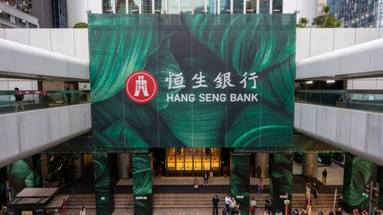
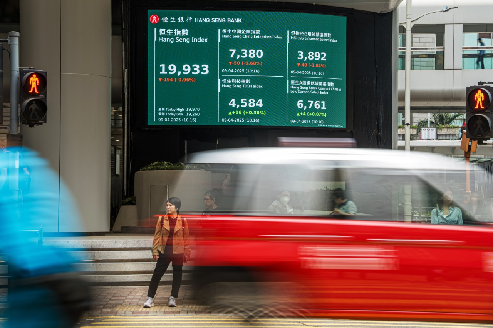

# Hang Seng Bank and Hang Seng Index Live News Report

> Generated: 2026-04-14 10:50 CST  
> Scope: latest public, English-language items and live market context related to **Hang Seng Bank** and the **Hang Seng Index (HSI)**.

## Executive Summary

- **Hang Seng Bank is leaning into AI deployment**, with a new "Living Lab" cohort focused on retail and commercial banking use cases.
- **Wealth management remains a priority**, shown by Hang Seng Bank's new distribution partnership with Capital Group.
- **The bank's macro view has turned more constructive**, after it raised its 2026 Hong Kong GDP growth forecast to 3.1%.
- **The Hang Seng Index is trading higher today**, with live quote pages and market commentary pointing to improving risk sentiment.
- **Broader HSI sentiment in 2026 remains constructive but not risk-free**, with support from policy, sector rotation, and IPO momentum, balanced against technical and macro volatility.

## 1. Latest Hang Seng Bank News

### 1) Hang Seng and HKSTP launch second AI "Living Lab" cohort

- **Date:** 2026-04-10
- **Source:** Hong Kong Business
- **Link:** https://hongkongbusiness.hk/banking-technology/news/ai-in-banking-takes-centre-stage-hang-seng-hkstp-launch-second-living-lab-cohort

**What happened**  
Hang Seng Bank and Hong Kong Science and Technology Parks Corporation launched the second cohort of their "Living Lab" programme to test AI solutions in real operating environments. The new phase focuses on retail and commercial banking.

**Why it matters**  
The bank is moving from AI pilots toward operational deployment. The announced use cases, including generative AI response validation and multilingual voicebots for business banking centres, suggest a practical efficiency and service-quality push rather than pure experimentation.

**Key details**
- Retail banking focus: AI validation agent for generative chatbot outputs.
- Commercial banking focus: multilingual customer-service voicebot.
- Applications open on 14 April, with final selections expected in the second half of the year.

---

### 2) Hang Seng Bank partners with Capital Group in Hong Kong

- **Date:** 2026-04-10
- **Source:** Fund Selector Asia
- **Link:** https://fundselectorasia.com/hang-seng-bank-partners-with-capital-group-in-hong-kong/

**What happened**  
Hang Seng Bank partnered with Capital Group to distribute four investment funds spanning US equities, global equities, fixed income, and multi-asset strategies. It also secured a three-month exclusive distribution window for Capital Group Investment Company of America for retail customers.

**Why it matters**  
This reinforces Hang Seng Bank's wealth-management strategy and suggests it is still using product breadth and exclusive access to defend and grow affluent and retail investor relationships.

**Key details**
- Four funds across equities, fixed income, and multi-asset.
- Three-month exclusivity for a flagship US equity offering.
- Management framed the tie-up as aligned with long-term investing and broader customer solutions.

---

### 3) Hang Seng Bank raises its 2026 Hong Kong GDP growth forecast to 3.1%

- **Date:** 2026-03-25
- **Source:** The Standard
- **Link:** https://www.thestandard.com.hk/finance/article/327435/Hang-Seng-Bank-upgrades-2026-HK-GDP-growth-forecast-to-31pc

**What happened**  
Hang Seng Bank raised its 2026 Hong Kong GDP growth forecast from 2.5% to 3.1%.

**Why it matters**  
This is not just an economics call. It supports the bank's broader client narrative across retail banking, wealth, and investment strategy. A more optimistic house view can also support risk appetite among clients and improve the backdrop for transaction and wealth activity.

**Key details**
- Improved outlook tied to better domestic and external conditions.
- The bank highlighted stronger retail conditions, helped by asset-market performance.
- It also noted tourism and competitiveness benefits from FX dynamics.

## 2. Latest Hang Seng Index (HSI) Live Context

### 1) Hang Seng Index live quote: trading higher in today's session

- **Date checked:** 2026-04-14
- **Source:** CNBC quote page
- **Link:** https://www.cnbc.com/quotes/.HSI

**Live snapshot at fetch time**  
CNBC showed the Hang Seng Index at **25,869.09**, up **208.24 points (+0.81%)**, with the page timestamped **10:30 AM CTT** at the time of retrieval.

**Why it matters**  
This confirms that the index was trading in positive territory during today's session, consistent with a short-term improvement in sentiment.

**Additional quote details**
- Open: 25,929.40
- Day high: 25,995.09
- Day low: 25,849.72
- Previous close: 25,660.85
- 52-week range: 20,868.36 to 28,056.10

---

### 2) TradingEconomics: HSI rebounds on improved risk sentiment

- **Date checked:** 2026-04-14
- **Source:** TradingEconomics
- **Link:** https://tradingeconomics.com/hong-kong/stock-market

**What the page said**  
TradingEconomics reported the Hang Seng Index climbed about **1.1% to around 25,940** on Tuesday, citing better risk appetite linked to optimism around a potential Iran deal, softer oil prices, and gains in financial and technology shares.

**Why it matters**  
This provides a market narrative behind today's move: lower geopolitical stress and easing inflation concerns are helping cyclicals and growth names.

**Additional market context from the same page**
- Hong Kong's main stock market index was shown around **25,905** on 14 April.
- The index was up roughly **0.27% over the past month**.
- It was up roughly **20.68% year on year**.

---

### 3) 2026 outlook: solid YTD progress, but watch technical risk

- **Date:** 2026-02-04
- **Source:** IG
- **Link:** https://www.ig.com/en/news-and-trade-ideas/hong-kong-equities-progress-review-260204

**What happened**  
IG said the Hang Seng Index had gained **4.4% year to date** by early February, briefly traded above **28,000**, and remained on track with its year-end base-case target of **28,300**.

**Why it matters**  
Although this is not a same-day news flash, it is useful strategic context for the HSI. It shows that the 2026 rally has been supported by sector rotation, policy easing expectations, and stronger IPO activity, while also warning of technical fragility if support levels fail.

**Key details**
- Sector leadership broadened into real estate, materials, and industrials.
- IPO momentum and new-economy listings remained important support factors.
- IG warned that failure to reclaim 27,400 could worsen the technical setup.

## 3. Bottom Line

### For Hang Seng Bank

The current news flow suggests three main themes:
1. **AI execution** is accelerating.
2. **Wealth management distribution** remains a growth lever.
3. **A more positive Hong Kong macro outlook** supports the bank's broader business narrative.

### For the Hang Seng Index

The latest live data points to a **positive session on 14 April**, with the move helped by improving short-term risk sentiment. Strategically, the HSI still looks supported by policy and capital-market momentum, but headline risk and technical levels remain important.

## Sources

1. Hong Kong Business, "AI in banking takes centre stage as Hang Seng, HKSTP launch second 'Living Lab' cohort"  
   https://hongkongbusiness.hk/banking-technology/news/ai-in-banking-takes-centre-stage-hang-seng-hkstp-launch-second-living-lab-cohort
2. Fund Selector Asia, "Hang Seng Bank partners with Capital Group in Hong Kong"  
   https://fundselectorasia.com/hang-seng-bank-partners-with-capital-group-in-hong-kong/
3. The Standard, "Hang Seng Bank upgrades 2026 HK GDP growth forecast to 3.1pc"  
   https://www.thestandard.com.hk/finance/article/327435/Hang-Seng-Bank-upgrades-2026-HK-GDP-growth-forecast-to-31pc
4. CNBC, ".HSI: Hang Seng Index - Stock Price, Quote and News"  
   https://www.cnbc.com/quotes/.HSI
5. TradingEconomics, "Hong Kong Stock Market Index (HK50) - Quote - Chart - Historical Data - News"  
   https://tradingeconomics.com/hong-kong/stock-market
6. IG, "Hong Kong equities on track to meet 2026 target with solid start"  
   https://www.ig.com/en/news-and-trade-ideas/hong-kong-equities-progress-review-260204
